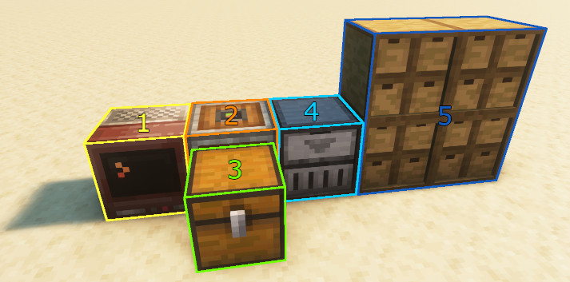

# storageManager

WORK IN PROGRESS

A script to push and pull items from storage. This is based on storage drawers and for now will only support one drawer controller connected to multiple storage drawers.

# Setup

- [1] Computer
- [2] Wired Modem (Right-click to make sure everything is connected!)
- [3] Transfer Chest (In- and Output)
- [4] Drawer Controller
- [5] Drawers

**Note:** You may leave space between Computer, Chest and Drawer Controller but you will need an modem next to each of those and have those modems connected via cables.
You may also omit the modems entirely and have the Computer in between the Chest and the Drawer Controller. I would recommend to place the modem, since that will add the names of the connected peripherals to the output when using the `peripherals` command.

# API
_Note: Currently errors are not handled properly and the `success` field in the response may not always be accurate._

Below you can find the available commands and an example for their requests and responses.

## Peripherals
Request example:
```lua
local message = {
    ["command"] = "peripherals",
}
```

Response example:
```lua
local message = {
    ["success"] = true, -- returns if the call was successful or not
    ["peripherals"] = {
        peripheral <string>,
        -- ...
    }
}
```

## List
Request example:
```lua
local message = {
    ["command"] = "list",
    ["peripheral"] = <string> -- peripheral name (e.g.: `minecraft:chest_2`)
}
```

Response example:
```lua
local message = {
    ["success"] = true, -- returns if the call was successful or not
    ["items"] = {
        [itemName <string>] = {
            -- note: slot is a number but returns as string so it does not mess with the table
            [slot <string>] = itemCount <number>
        },
        -- ...
    }
}
```

## Put
Request example:
```lua
local message = {
    ["command"] = "put",
    ["from"] = <string>, -- peripheral name (e.g.: `minecraft:chest_2`)
    ["to"] = <string>, -- peripheral name (e.g.: `minecraft:chest_2`)
    ["fromSlot"] = <number>,
    ["count"] = <number>, -- defaults to 1
    ["toSlot"] = <number>, -- toSlot, will use any slot if not specified
}
```

Response example:
```lua
local message = {
    ["success"] = true -- returns if the call was successful or not
}
```

## Extract
Request example:
```lua
local message = {
    ["command"] = "extract",
    ["from"] = <string>, -- peripheral name (e.g.: `minecraft:chest_2`)
    ["to"] = <string>, -- peripheral name (e.g.: `minecraft:chest_2`)
    ["fromSlot"] = <number>,
    ["count"] = <number>, -- defaults to 1
    ["toSlot"] = <number>, -- toSlot, will use any slot if not specified
}
```

Response example:
```lua
local message = {
    ["success"] = true -- returns if the call was successful or not
}
```
